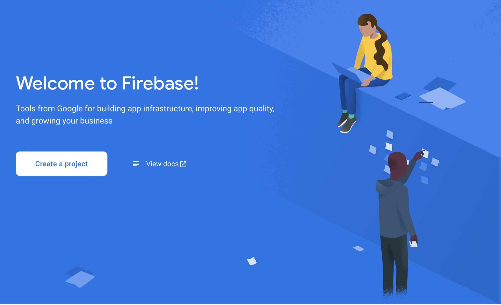
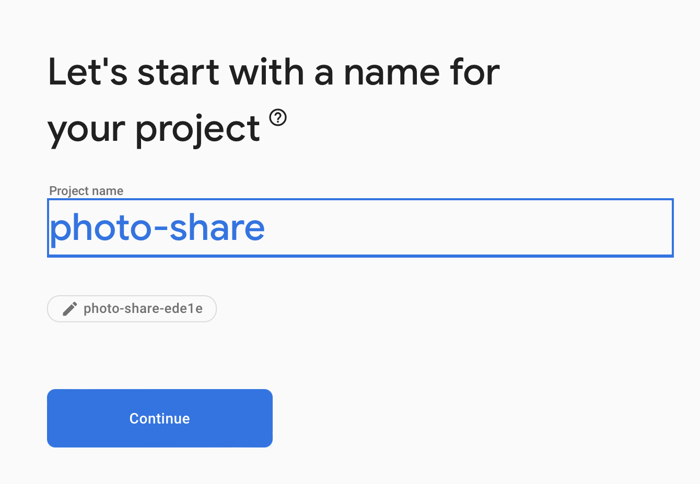
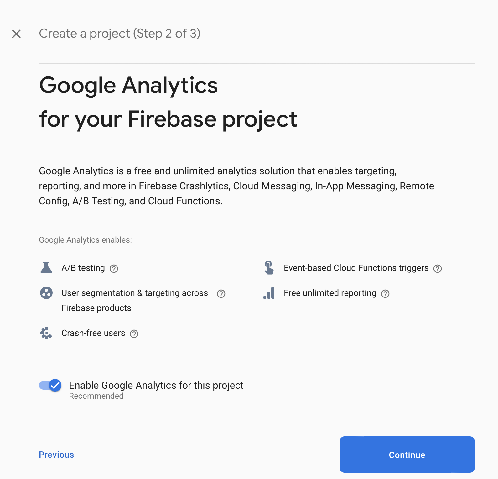
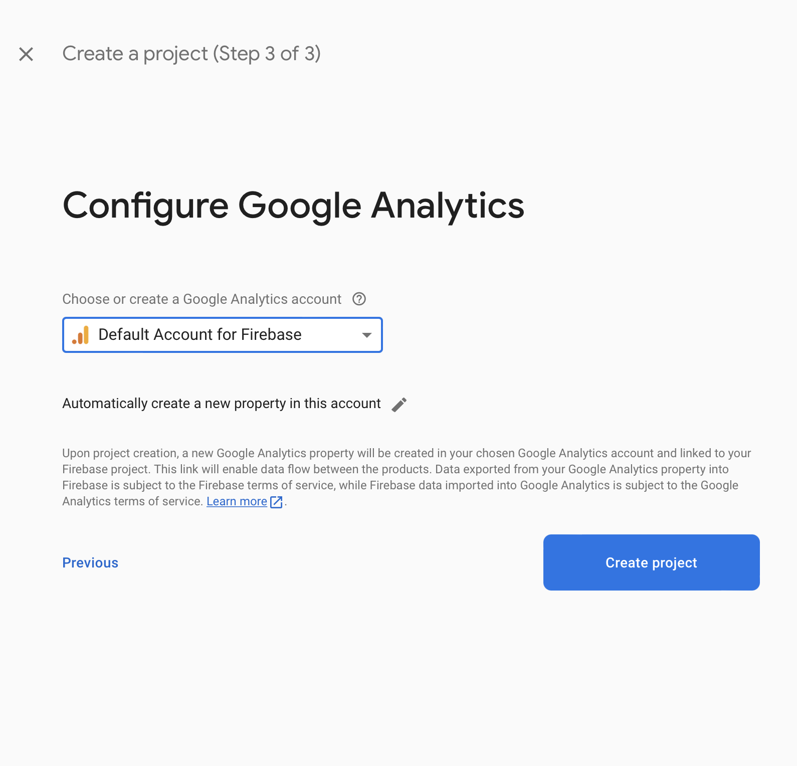
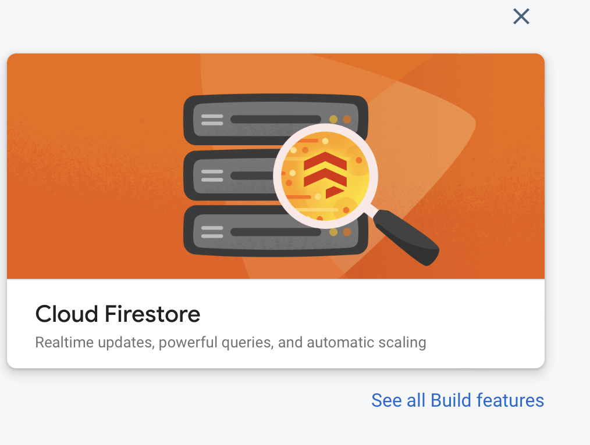
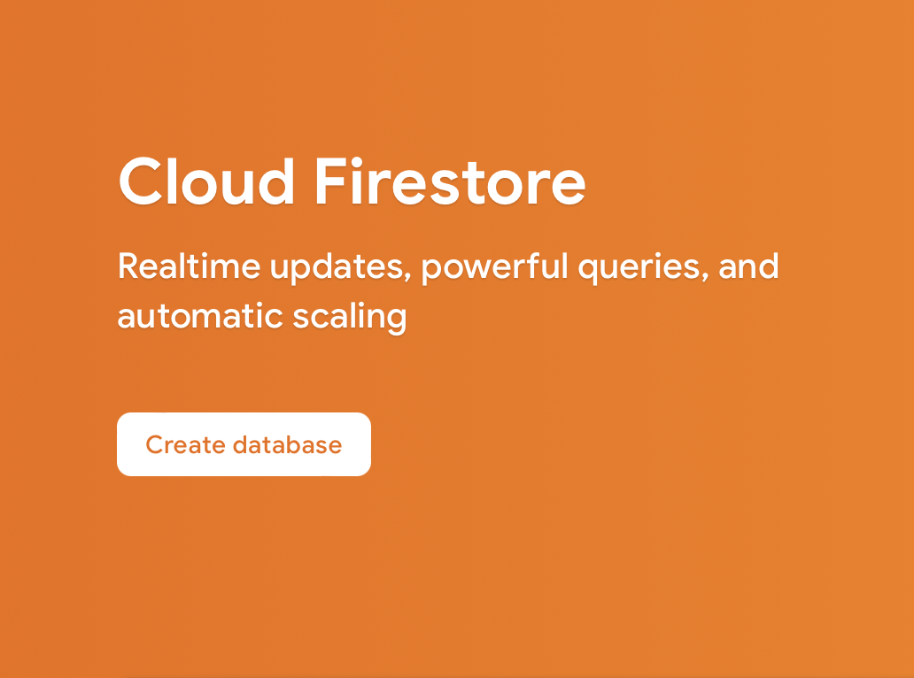
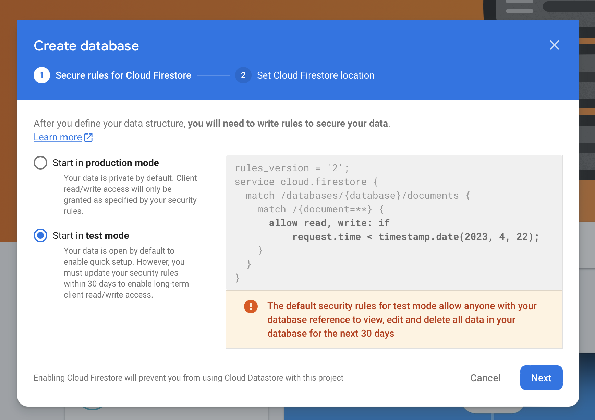
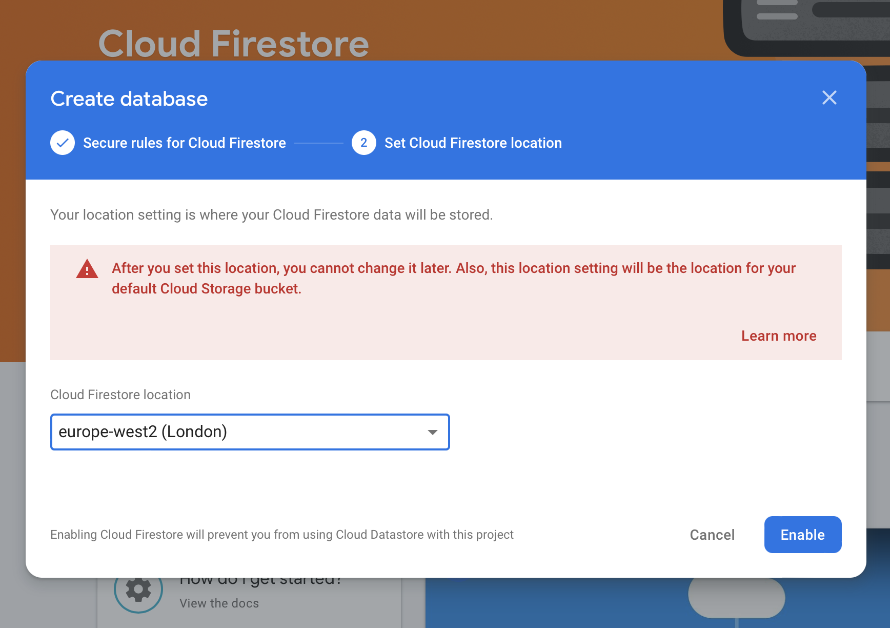
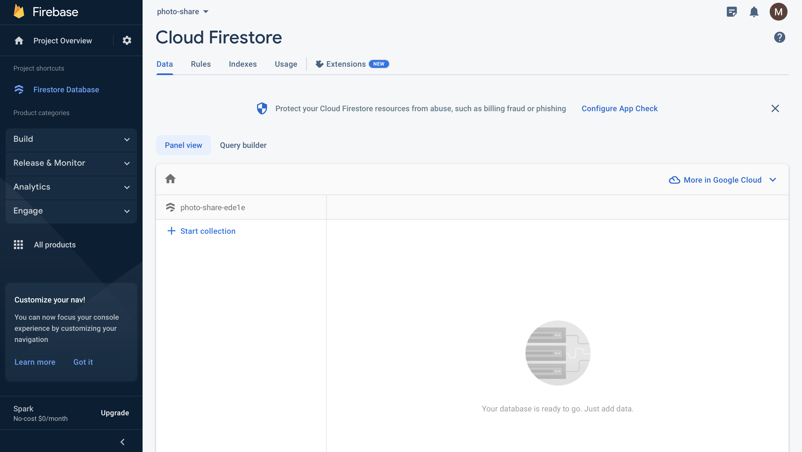

1. Go to the [Firebase console](https://console.firebase.google.com), login to Google and select Create a project

2. Name your app

3. Enable Google Analytics (this is not necessary for now but you may this useful later).

4. Choose 'Default Account for Firebase' and select Create Project

5. In the console, select Cloud Firestore and then select Create database

6. Select Start in Test Mode, then press next

7. Select europe-west2 (London) as the location of your database

8. Return to console

9. To get the credentials you need for web app, go to the cog and select Project Settings from the drop down. From this page, copy `firebaseConfig`.
