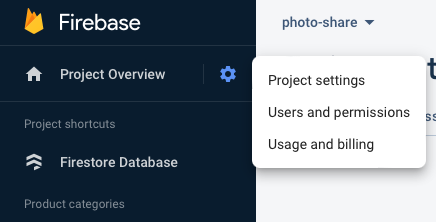

## Create a Firestore Database

1. Go to the [Firebase console](https://console.firebase.google.com), login to Google and select Create a project

2. Name your app

3. Enable Google Analytics (this is not necessary for now but you may this useful later).

4. Choose 'Default Account for Firebase' and select Create Project

5. In the left sidebar click on build and from the dropdown selection Firestore Database
    

6. Click Create database
    

6. Select Start in Test Mode, then press next

7. Select europe-west2 (London) as the location of your database

8. Return to console

## Create Credentials

1. To get the credentials you need for web app, go to the cog and select Project Settings from the drop down.

    

2. Under your apps you will see a blue button with angle brackets, click here and register your project name when prompted.

    

3. Create your app credentials
    

4. You can copy the firebaseConfig and paste to them where you need them in your app.