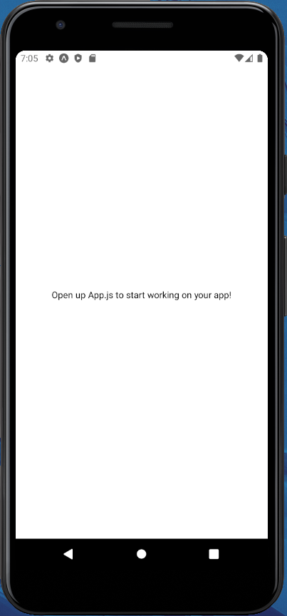

## Node
1. Check if node is installed on your machine with `node -v`.
2. If it's not, install node:
    - On windows: https://nodejs.org/en/
    - On mac: `brew install node`

## Expo
1. Sign up for an expo.io account https://expo.io/signup, confirm your details and log in.
2. Get the Expo client app on your phone. Download the client for:
	- [iOS](https://apps.apple.com/us/app/expo-go/id982107779)
	- [Android](https://play.google.com/store/apps/details?id=host.exp.exponent&hl=en_GB&gl=US&pli=1)
3. Log in to the Expo client app on your phone

4. Login with the credentials you created:
    ``` 
    npx expo login -u your-username -p your-password
    ```

## Test the app using CLI development server
1. Install the Expo ngrok plugin `npm install @expo/ngrok@^4.1.0`

2. In the labs, ngrok is installed. If you are using your own machine you will need to install ngrok.
    - Download Windows version from here: [ngrok.com/download](https://ngrok.com/download)
    - On Mac: `brew install ngrok`
    

3. Navigate to the project folder and run `npx expo start --tunnel`

4. Scan the QR code that appears with your phone camera and follow link to open the Expo app.

5. Open your app!

## Test the app using Android Studio Emulator
1. Open Android Studio and on the menu page go to _More Actions_ and select _Virtual Device Manager_ .


2. There should be a Pixel device listed. Press the Play button and wait for the emulator to boot.


3. Once booted, from your app project folder run `npx expo start` and then, as in the menu, press a to run in the Android emulator.


