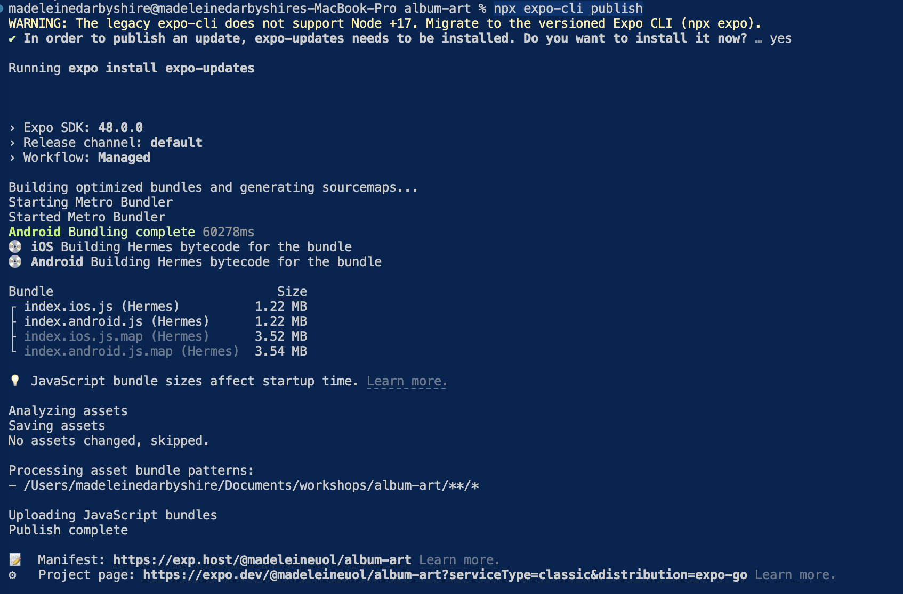
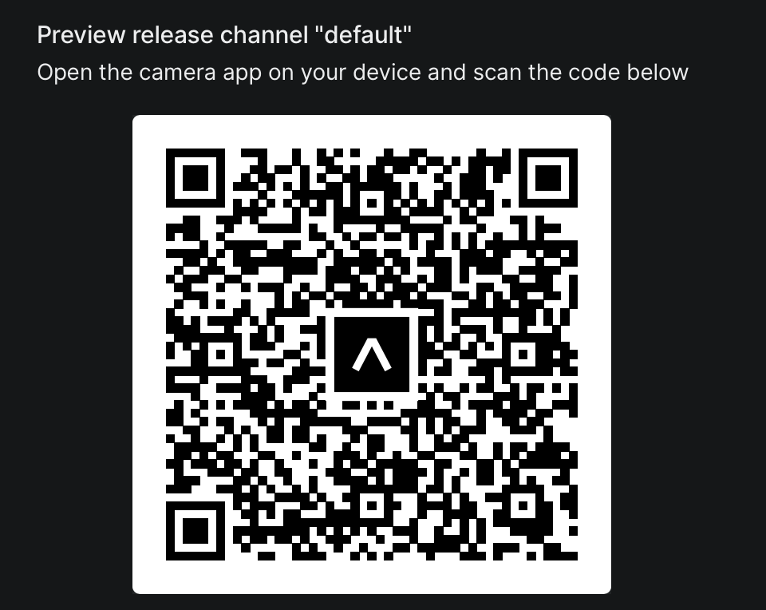

For your assignment, you will need to include a QR code we can use to run your apps. We are going to use Expo Publish but since this is a legacy package you will need to install expo-cli (as opposed to expo) to run it.

1. If you haven't already got expo-cli installed, install it with:
```
cd <your-project>
npm install expo-cli
```

2. Run:
```
npx expo-cli publish
```

    

3. Follow the link to your project page and copy your QR code to include in your report:

    

