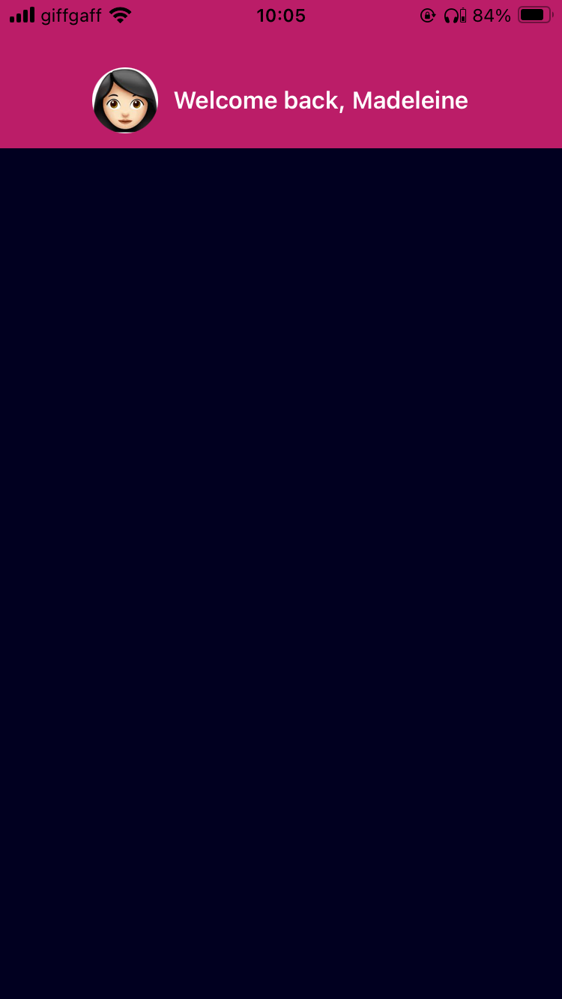

<style type="text/css">
  img { max-height: 500px;
        border-style: solid;
        border-width: thin;
        display: block;
        margin-left: auto;
        margin-right: auto;
      }
</style>

## Node
1. Check if node is installed on your machine with `node -v`.
2. If it's not, install node:
    - On windows: https://nodejs.org/en/
    - On mac: `brew install node`

## Expo
1. Sign up for an expo.io account https://expo.io/signup, confirm your details and log in.
2. Get the Expo client app on your phone. Download the client for:
	- [iOS](https://apps.apple.com/us/app/expo-go/id982107779)
	- [Android](https://play.google.com/store/apps/details?id=host.exp.exponent&hl=en_GB&gl=US&pli=1)
3. Log in to the Expo client app on your phone

4. Login with the credentials you created:
    ``` 
    npx expo login -u your-username -p your-password
    ```

## Creating a new app
1. Navigate in your terminal to where you want to install you want to install your app and run:
    ```javascript
    npx create-expo-app
    ```

2. Name your project when prompted. I called mine superhero app.


## Test the app using CLI development server
1. Install the Expo ngrok plugin `npm install @expo/ngrok@^4.1.0`

2. In the labs, ngrok is installed. If you are using your own machine you will need to install ngrok.
    - Download Windows version from here: [ngrok.com/download](https://ngrok.com/download)
    - On Mac: `brew install ngrok`
    

3. Navigate to the project folder and run `npx expo start --tunnel`

4. Scan the QR code that appears with your phone camera and follow link to open the Expo app.

5. Open your app!

## Test the app using Android Studio Emulator
1. Open Android Studio and on the menu page go to _More Actions_ and select _Virtual Device Manager_ .


2. There should be a Pixel device listed. Press the Play button and wait for the emulator to boot.


3. Once booted, from your app project folder run `npx expo start` and then, as in the menu, press a to run in the Android emulator.


## Hello World!
1. Open the project folder in your favourite editor, or something like VSCode or atom, and change the text in `<Text>` in _App.js_ to 'Hello World!'

2. Check to see if the text in your app has changed!


## Make a Component
First of all, we need a Titlebar for our page so we will make a new component for that. 

1. Define a new function called `Titlebar` about the `App` function. We are going to start will a `View` component with a text component inside.

    ```jsx
    function Titlebar() {
      return (
        <View>
          <Text>Welcome back, Madeleine</Text>
        </View>
      );
    }
    ```

2. Update the `App()` function so it calls the `<Titlebar />` component like this:

    ```jsx
    export default function App() {
      return (
        <View style={styles.container}>
          <Titlebar />
        </View>
      );
    }
    ```


We want to move the titlebar to the top of the screen. To do this we will add some styling to `View`.

## Basic Styling
React is based on creating/styling components and reusing them. There a many ways to style a component, the React way uses the [StyleSheet.create()](https://reactnative.dev/docs/stylesheet) method and would looks similar to below when styling the container.

```javascript
const styles = StyleSheet.create({
  container: {
    flex: 1,
    backgroundColor: '#fff',
    alignItems: 'center',
    justifyContent: 'center',
  },
});
```

1. To move our titlebar to the top of the page we need to adapt the properties in `container`. The property `justifyContent: 'center'` is moving our TitleBar to the centering the content vertically, while `alignItems` is centering content horizontally. We will remove these to move our titlebar to the top and to the left.

    ```javascript
    const styles = StyleSheet.create({
      container: {
        flex: 1,
        backgroundColor: '#fff'
      }
    });
    ```

2. Ok, now it's moved _too_ far up. Let's create some style for the titlebar to get it into the correct position, start by adding in the property `titlebar` as follows.

    ```javascript
    const styles = StyleSheet.create({
      container: {
        flex: 1,
        backgroundColor: '#fff'
      },
      titlebar: {
          
      }
    });
    ```

3. Update the `View` component in `TitleBar` to take styles from `styles.titlebar`:

    ```jsx
    function Titlebar() {
      return (
        <View style={styles.titlebar}>
          <Text>Welcome back, Madeleine</Text>
        </View>
      );
    }
    ```

4. Add `paddingTop: 40` the `titlebar` object in your `StyleSheet` object to move the content in the titlebar down 25 pixels and `paddingBottom: 10` to create some space between this and the content beneath. We want to centre the content too so add `justifyContent: 'center'` and `alignItems: 'center'`.

    ```javascript
    titlebar: {
      justifyContent: 'center',
      alignItems: 'center',
      paddingTop: 40,
      paddingBottom: 10
    }
    ```

## Insert an Image from a URL
Yes, that's right, you can insert images straight into your app, just using the URL!

1. Update the `'react-native'` import statement with the [Image](https://reactnative.dev/docs/image) component, so it looks like this:

    ```javascript
    import { Image, StyleSheet, Text, View } from 'react-native';
    ```

2. Inside the `View` component, above the `Text` component, in the `TitleBar()` function add the `Image` component with this URL:

    ```jsx
    <Image source={{uri: 'https://madeleinedarbyshire.github.io/CMP3035/assets/workshop1/avatar.jpeg'}} />
    ```

3. _Hmmmm..._ if you reload your app, you won't see anything change yet! You need to set the height and the width. Append the following into the Stylesheet object (after container and titlebar) :

    ```javascript
    avatar: {
      width: 44,
      height: 44
    }
    ```

4. Now set the style property on the `Image` component: `style={styles.avatar}` . You should now see an avatar.


5. The avatar is in an odd position at the moment, so let's move it to the left of the greeting. By default all child components of a `View` component are stacked vertically, but we want them to sit side-by-side. To do this, we need to set the `flexDirection` to be `'row'`. 

    ```javascript
    titlebar: {
      justifyContent: 'center',
      alignItems: 'center',
      paddingTop: 40,
      paddingBottom: 10,
      flexDirection: 'row'
    }
    ```

## Add your own avatar from file
Currently, you have my avatar, but if you would like to add your own, you can add your own avatar image to the _assets_ folder. You can then update the source property as follows:

```jsx
<Image style={styles.avatar} source={require('./assets/me.png')} />
```


## Adding Colors
Here we are going to add some color to the app. Color's here are defined by a hash followed by a 6 digit hexadecimal number. If you'd like to customise the app with your own colors, you can use [Google's color picker](https://g.co/kgs/sFAjM6R) to find colors you like and their hex codes.

1. Update the `backgroundColor` of `styles.container` to be `'#010020'`.

2. Ooops, now you can't see the text! Create a property called `title` color in `StyleSheet.create()` and set the `color` property to `#fff` (this is the hex code for white):

    ```javascript
    title: {
      color: '#fff'
    }
    ```

3. In the `Titlebar()` function, update the `<Text>` component to include the style property: `style={styles.title}`

4. Let's make a few more improvements to the `title` text:
    - `marginLeft: 10` - to add some space between the avatar and the title
    - `fontSize: 16` - to increase the font size
    - `fontWeight: '600'` - to make the title text bold

5. Make the Titlebar a different color by adding the `backgroundColor: '#bb1d68'` to the titlebar property in the StyleSheet.

6. Finally, let's round the edges on our avatar component to make it look nicer. To do this, set the `borderRadius` property to 22 pixels.
    ```javascript
    avatar: {
      width: 44,
      height: 44,
      borderRadius: 22
    }
    ```



## Exporting components
1. Create a new folder at the root of your project called _components_ .

2. Within that new folder, create a new file called _Categories.js_ .

3. At the top of the file import the following in `'react-native'`:

    ```javascript
    import { StyleSheet, Text, View } from 'react-native';
    ```

4. Define a default export function: 

    ```jsx
    export default function Category() {
      return (
        <View>
          <Text style={styles.name}>Item1</Text>
        </View>
      );
    }
    ```

5. Create a StyleSheet component underneath and define `styles.name`:

    ```javascript
    const styles = StyleSheet.create({
      name: {
        color: '#fff',
        fontSize: 16,
        fontWeight: '300',
        marginLeft: 15
      }
    });
    ```

6. Set the `style` property on the `Text` component in `Categories` to be `styles.name`.

7. Now you can try importing the function into _App.js_

    ```javascript
    import Category from './components/Category';
    ```

8. Call `<Category />` in `App()`

    ```jsx
    export default function App() {
      return (
        <View style={styles.container}>
          <Titlebar />
          <Category />
        </View>
      );
    }
    ```

## Mapping through a list
1. Copy and paste this list of items at the top of _App.js_

    ```javascript
    const items = [
      { text: 'Ironman',
        image: 'https://madeleinedarbyshire.github.io/CMP3035/assets/workshop1/pic1.jpg',
        description: 'Iron Man is a genius billionaire, Tony Stark, who suits up in a technologically advanced armor to fight crime and protect the world.',
        characteristics: {speed: 3, strength: 4, intelligence: 5, morality: 4}},
      { text: 'Captain America',
        image: 'https://madeleinedarbyshire.github.io/CMP3035/assets/workshop1/pic2.jpg',
        description: 'Captain America, also known as Steve Rogers, is a super-soldier with enhanced strength and agility, wielding his iconic vibranium shield to defend justice.',
        characteristics: {speed: 3, strength: 4, intelligence: 3, morality: 5}},
      { text: 'Thor',
        image: 'https://madeleinedarbyshire.github.io/CMP3035/assets/workshop1/pic3.jpg',
        description: 'Thor, the God of Thunder, possesses incredible strength and wields the enchanted hammer Mjolnir.',
        characteristics: {speed: 4, strength: 5, intelligence: 3, morality: 4}},
      { text: 'Black Widow',
        image: 'https://madeleinedarbyshire.github.io/CMP3035/assets/workshop1/pic4.jpg',
        description: 'Black Widow, aka Natasha Romanoff, is a highly skilled and agile spy and assassin with a mysterious past.',
        characteristics: {speed: 4, strength: 3, intelligence: 4, morality: 4}},
      { text: 'Hawkeye',
        image: 'https://madeleinedarbyshire.github.io/CMP3035/assets/workshop1/pic5.jpg',
        description: 'Hawkeye, or Clint Barton, is a master archer and skilled marksman with exceptional accuracy and agility',
        characteristics: {speed: 3, strength: 3, intelligence: 3, morality: 4}},
      { text: 'The Hulk',
        image: 'https://madeleinedarbyshire.github.io/CMP3035/assets/workshop1/pic6.jpg',
        description: 'A brilliant scientist, Bruce Banner transforms into the Hulk, an unstoppable force of raw strength and rage.',
        characteristics: {speed: 2, strength: 5, intelligence: 3, morality: 3}},
      { text: 'Captain Marvel',
        image: 'https://madeleinedarbyshire.github.io/CMP3035/assets/workshop1/pic7.jpg',
        description: 'Endowed with cosmic powers after a fusion with Kree technology, Carol Danvers, aka Captain Marvel, is a formidable hero with superhuman strength, energy manipulation, and flight capabilities.',
        characteristics: {speed: 4, strength: 4, intelligence: 3, morality: 5}},
      { text: 'Ant-Man',
        image: 'https://madeleinedarbyshire.github.io/CMP3035/assets/workshop1/pic8.jpg',
        description: 'A skilled thief turned superhero, Scott Lang, as Ant-Man, can shrink to the size of an ant, control ants, and harness superhuman strength through his suit.',
        characteristics: {speed: 3, strength: 3, intelligence: 4, morality: 4}},
      { text: 'Okoye',
        image: 'https://madeleinedarbyshire.github.io/CMP3035/assets/workshop1/pic10.jpg',
        description: 'The fearless leader of the Dora Milaje and Wakanda\'s chief of security, Okoye is a highly skilled warrior known for her unparalleled combat abilities and unwavering loyalty to her people.',
        characteristics: {speed: 4, strength: 3, intelligence: 4, morality: 5}}
      ];
    ```

2. Use [map](https://developer.mozilla.org/en-US/docs/Web/JavaScript/Reference/Global_Objects/Map) to map over this list, replace <Category /> with:
    ```jsx
    {
      items.map((category, index) => (
        <Category name={category.text} source={category.image} key={index} />
      ))
    }
    ```

3. Notice above we have set the property `name` in Category. This values is now pass to Category in an object we will call `props`. In _Category.js_ , inside the Category function we can now access the `name` property and display the name as follows:
    ```jsx
    export default function Category(props) {
      return (
        <View style={styles.container}>
          <Text style={styles.name}>{props.name}</Text>
        </View>
      );
    }
    ```


4. Next, in _Category.js_, import the `Image` component:

  ```javascript
  import { Image, StyleSheet, Text, View } from 'react-native';
  ```

5. Call the `Image` function with the `source` property set using the source prop we pass into Category from App.js:
    ```jsx
    <Image source={{uri: props.source}} style={styles.image}/>
    ```

4. Add some styling to the components

    ```javascript
    const styles = StyleSheet.create({
      container: {
        flexDirection: 'row',
        paddingBottom: 10,
        paddingTop: 10,
        alignItems: 'center'
      },
      name: {
        color: '#fff',
        fontSize: 16,
        fontWeight: '300',
        marginLeft: 15
      },
      image: {
        width: 100,
        height: 100
      }
    });
    ```


## Adding ScrollView
This list is right now not scrollable. To make it scrollable, let us place it inside a ScrollView.

1. Open up _App.js_, import [ScrollView](https://reactnative.dev/docs/scrollview) from react-native, and wrap the list of Category components with a ScrollView component.

    ```jsx
    import { Image, ScrollView, StyleSheet, Text, View } from 'react-native';
    // ...
    <ScrollView>
      {
        items.map((category, index) => (
          <Category name={category.text} source={category.image} key={index} />
        ))
      }
    </ScrollView>
    ```

2. Add a subtitle:

    ```jsx
    <Text style={styles.subtitle}>Your Heroes</Text>
    <ScrollView>
      {items.map((category, index) => (
        <Categories name={category.text} key={index} />
      ))}
    </ScrollView>
    ```

3. Add styling for the subtitle:
    ```javascript
    subtitle :{
      color: '#fff',
      fontSize: 20,
      fontWeight: '500',
      padding: 10
    },
    ```


## Adding Navigation
We are now going to make this app a multipage app, with the screen we've just made being one of multiple.

1. Start stopping your app and by installing these packages:
    ```
    npx expo install @react-navigation/native @react-navigation/stack react-native-gesture-handler @react-native-masked-view/masked-view
    ```

2. Create a new folder at the root of your app called _screens_ . Rename your _App.js_ file to _HomeScreen.js_ and move this file into the _screens_ .

3. Now in the _HomeScreen.js_ file, rename the default export function from _App_ to _HomeScreen_ .

4. You will also need to update the imports and asset paths in _HomeScreen.js_ since the path to your components will have changed (your text editor might have done this for you, but check they are correct)

    ```javascript
    import Category from '../components/Category';
    //..
    <Image style={styles.avatar} source={require('../assets/me.png')} />
    ```

4. We will now make a new file at the root of the project called _App.js_ and into this we will put some navigation logic. First we start by importing and calling the [NavigationContainer](https://reactnavigation.org/docs/navigation-container):

    ```jsx
    import 'react-native-gesture-handler';
    import { NavigationContainer } from '@react-navigation/native';

    export default function App() {
      return (
      <NavigationContainer>
        {/* All your navigation will go in here. */}
      </NavigationContainer> 
      );
    }
    ```

5. Next we will create a [StackNavigator](https://reactnavigation.org/docs/stack-navigator) for our pages:

    ```javascript
    import { createStackNavigator } from '@react-navigation/stack';
    ```

6. Then we import the HomeScreen component from _screens_:
    ```javascript
    import HomeScreen from './screens/HomeScreen';
    ```

7. Finally, the `App` function we create a stack navigator and within this component we add our HomeScreen page. Note we are using `screenOptions` on the `Stack.Navigator` to hide the header because in this case it's not useful. Restart your app now if you haven't already. 
    ```jsx
    export default function App() {
      const Stack = createStackNavigator();
      return (
        <NavigationContainer>
          <Stack.Navigator
            screenOptions={{
                headerShown: false
            }}
          >
            <Stack.Screen name="Home" component={HomeScreen}></Stack.Screen>
          </Stack.Navigator>
        </NavigationContainer> 
      );
    }
    ```

## Create a the Character screen
1. Create a new file in the _screens_ folder called _CharacterScreen.js_ and at the top of the file import some basic stuff:

    ```javascript
    import { Image, StyleSheet, Text, View } from 'react-native';
    ```

2. Create a new default export called `CharacterScreen`:

    ```jsx
    export default function CharacterScreen(props) {
      return (
        <View style={styles.container}>
          <View style={styles.titlebar}>
            <Text style={styles.name}>{props.route.params.text}</Text>
          </View>
          <View style={styles.imageContainer}>
            <Image style={styles.image} source={{uri: props.route.params.image}} />
          </View>
          <View style={styles.content}>
            <Text style={styles.description}>{props.route.params.description}</Text>
          </View>
        </View>
      );
    }
    ```

3. Add in some styling:
    ```javascript
    const styles = StyleSheet.create({
      container: {
        flex: 1,
        backgroundColor: '#010020'
      },
      imageContainer : {
        flex: 2,
        alignItems: 'center',
        justifyContent: 'center',
        flexDirection: 'row'
      },
      image: {
        width: 200,
        height: 200
      },
      content: {
        flex: 3,
        marginLeft: 50,
        marginRight: 50,
        alignItems: 'center'
      },
      name: {
        color: '#fff',
        fontWeight: '600',
        fontSize: 16
      },
      description: {
        color: '#fff',
        fontSize: 14
      },
      titlebar: {
        justifyContent: 'center',
        alignItems: 'center',
        flexDirection: 'row',
        paddingTop: 40,
        paddingBottom: 10
      }
    });
    ```

4. Import the `CharacterScreen` into _App.js_ :

    ```javascript
    import CharacterScreen from './screens/CharacterScreen';
    ```

5. Add a `Stack.Screen` for the character screen to `Stack.Navigator` :

    ```jsx
    export default function App() {
      const Stack = createStackNavigator();
      return (
        <NavigationContainer>
          <Stack.Navigator
            screenOptions={{
                headerShown: false
            }}
          >
            <Stack.Screen name="Home" component={HomeScreen}></Stack.Screen>
            <Stack.Screen name="Character" component={CharacterScreen}></Stack.Screen>
          </Stack.Navigator>
        </NavigationContainer> 
      );
    }
    ```

## Navigating to the Character Screens
Ok so that was a lot of infrastructure, but now we will link our pages.

1. In the _Homescreen.js_ page, we need to import a new component from `'react-native` called [TouchableOpacity](https://reactnative.dev/docs/touchableopacity):

    ```javascript
    import { Image, StyleSheet, Text, TouchableOpacity, View } from 'react-native';
    ```

2. Inside the HomeScreen function (the one you should have renamed from App in the previous section), we are going to wrap the `View` component with `TouchableOpacity`, you will also need to move the `key` property from `Category` to `TouchableOpacity`.

    ```jsx
    <ScrollView >
      {
        items.map((category, index) => (
          <TouchableOpacity key={index}>
            <Category name={category.text} source={category.image} description={category.description} />
          </TouchableOpacity>
        ))
      }
    </ScrollView>
    ```

3. Update the HomeScreen function to take an argument called props. The native stack navigator passes the `navigation` prop to every screen component. We can call `props.navigation.navigate()` with the screen we want to navigate to and any params. We can set the `onPress` property on `TouchableOpacity` so that we navigate to this screen when this component is pressed, we do so as follows:

    ```jsx
    <TouchableOpacity key={index} onPress={() => props.navigation.navigate('Character', category)}>
    ```


## Navigating Back to the Home Screen
You should be able to use gestures to navigate back but to make it easier for users we will implement a back button.

1. Import `TouchableOpacity`:

    ```javascript
    import { Image, StyleSheet, Text, TouchableOpacity, View } from 'react-native';
    ```

2. Import `Ionicons`:

    ```javascript
    import { Ionicons } from '@expo/vector-icons';
    ```

3. Inside the titlebar, above the title, create a `TouchableOpacity` with an `chevron-back-outline` icon:

    ```jsx
    <TouchableOpacity style={styles.backButton}>
      <Ionicons name="chevron-back-outline" size={24} color="#fff" />
    </TouchableOpacity>
    ```


4. Add the styling to `Stylesheet`

    ```javascript
    backButton: {
      position: 'absolute',
      left: 0, 
      top: 0, 
      marginTop: 25, 
      padding: 10
    }
    ```

5. Finally, set the `onPress` property, so that pressing the button navigates back to the HomeScreen:
    ```jsx
    onPress={() => props.navigation.navigate('Home')}
    ```

## Add Characteristics to the CharacterScreen

1. Create a new component in _CharacterScreen.js_ called `Characteristic`:

    ```jsx
    function Characteristic(props) {
        return (
          <View style={styles.characteristic}>
            <Text style={styles.categoryText}>{props.category}</Text>
            <Text style={styles.categoryText}>: </Text>
            <Text style={styles.description}>{props.rating}</Text>
          </View>
        );
    }
    ```

2. Append styling to the `StyleSheet`:

    ```javascript
    characteristic: {
      flexDirection: 'row',
      paddingTop: 20
    },
    categoryText: {
      color: '#fff',
      fontSize: 14,
      fontWeight: '600'
    }
    ```

3. Call `Characteristic` inside the content view, underneath the description:

    ```jsx
    <View style={styles.content}>
      <Text style={styles.description}>{props.route.params.description}</Text>
      <Characteristic category="Speed" rating={props.route.params.characteristics.speed} />
    </View>
    ```


4. Add all of the other characteristics.


5. Extension: Can you figure out how to display the characteristics in two columns?


## Check How Your App Looks on Different Devices
In Android studio, go to create device and try running the app on different devices and check the UI still looks ok.

