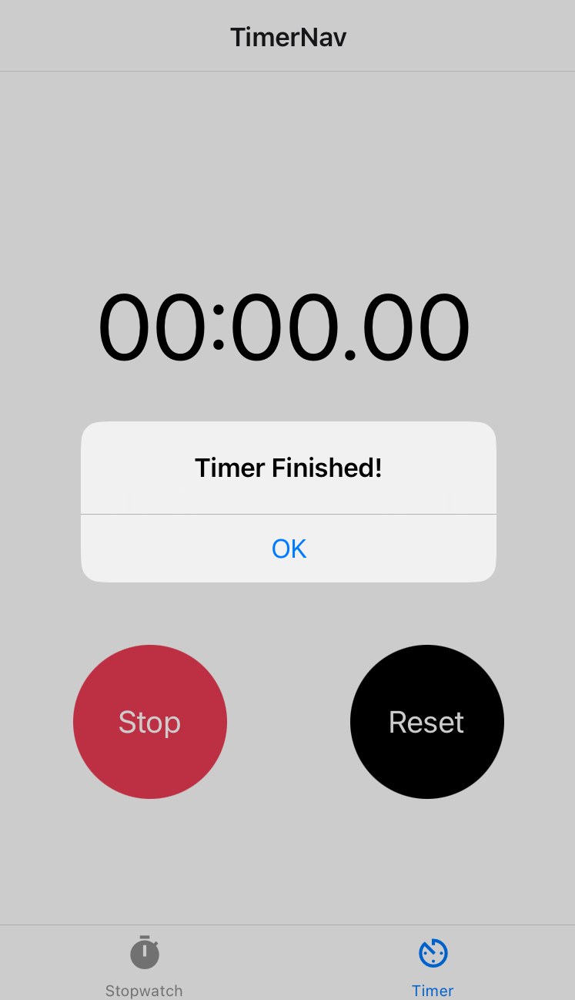

<style type="text/css">
  img { max-height: 500px;
        border-style: solid;
        border-width: thin;
        display: block;
        margin-left: auto;
        margin-right: auto;
      }
</style>

## Prerequistes

### Node
1. Check if node is installed on your machine with `node -v`.
2. If it's not, install node:
    - On windows: [https://nodejs.org/en/](https://nodejs.org/en/)
    - On mac: `brew install node`

### Expo
1. Sign up for an expo.io account https://expo.io/signup, confirm your details and log in.
2. Get the Expo client app on your phone. Download the client for:
	- [iOS](https://apps.apple.com/us/app/expo-go/id982107779)
	- [Android](https://play.google.com/store/apps/details?id=host.exp.exponent&hl=en_GB&gl=US&pli=1)
3. Log in to the Expo client app on your phone

4. Login with the credentials you created:
    ``` 
    npx expo login -u your-username -p your-password
    ```

### ngrok
1. Install the Expo ngrok plugin `npm install @expo/ngrok`

2. Install ngrok
    - Download Windows version from here: [ngrok.com/download](https://ngrok.com/download)
    - On Mac: `brew install ngrok`


## Create your clock app!
1. Navigate in your terminal to where you want to install you want to install your app and run:
    ```
    npx create-expo-app
    ```

2. Name your app _clock-app_ or something similar when prompted.

3. From inside the project folder you just created, start the app: `npx expo start --tunnel`

4. You should just see this placeholder screen.


## Create a stopwatch component
1. Create a new folder in the root of the project folder called _screens_ .

2. Create a new file called _Stopwatch.js_ inside the _screens_ folder.

3. In _Stopwatch.js_ add a basic view:
    ```jsx
    import { StyleSheet, Text, View } from 'react-native';

    export default function Stopwatch() {
    return (
      <View style={styles.container}>
        <View style={styles.clock}>
          <Text style={styles.digits}>00:00.00</Text>
        </View>
      </View>
    );
    }

    const styles = StyleSheet.create({
      container: {
        flex: 1,
        backgroundColor: '#fff',
        alignItems: 'center',
        justifyContent: 'center',
      },
      clock: {
        flex: 3,
        justifyContent: 'center'
      },
      digits: {
        fontSize: 60
      }
    });
    ```

4. You won't see any changes in your App yet, first we need to add some navigation.

## Create Bottom Tab Navigation
1. Install the following libraries for navigation:
    ```
    npx expo install @react-navigation/native @react-navigation/bottom-tabs react-native-gesture-handler @react-native-masked-view/masked-view @expo/vector-icons
    ```

2. In App.js, delete all existing code, import your Stopwatch component and the react native navigation libraries:
    ```javascript
    import { NavigationContainer } from '@react-navigation/native';
    import { createBottomTabNavigator } from '@react-navigation/bottom-tabs';
    import Stopwatch from './screens/Stopwatch';
    import MaterialCommunityIcons from '@expo/vector-icons/MaterialCommunityIcons';
    ```

4. Create a TabNav function. Note we're going to use an arrow function, you could use a regular function too, but we're going to start using arrow functions to get used to the syntax. You need to call [createBottomTabNavigator](https://reactnavigation.org/docs/bottom-tab-navigator/) and use the resulting _Tab_ object to create this JSX object.
    ```jsx
    const TabNav = () => {
      const Tab = createBottomTabNavigator();
      return (
        <Tab.Navigator>
          <Tab.Screen 
           name="Stopwatch" 
           component={Stopwatch} />
        </Tab.Navigator>
      );
    }
    ```

5. Refine the App function returning the [NavigationContainer](https://reactnavigation.org/docs/navigation-container/)
    ```jsx
    export default function App() {
      return (
        <NavigationContainer>
          <TabNav/>
        </NavigationContainer> 
      );
    }
    ```

6. Hopefully, you've got a screen that looks like this:


## Adding Icons
1. We need to import _MaterialCommumityIcons_ from [@expo/vector-icons](https://icons.expo.fyi/Index) into App.js .
  ```jsx
  import MaterialCommunityIcons from '@expo/vector-icons/MaterialCommunityIcons';
  ```

2. Now we have to update the Stopwatch Tab.Screen component with the stopwatch icon. We have to endure some difficult syntax here. We set the options property to be an object with the tabBarIcon property set as a function that returns an [MaterialCommunityIcon timer component](https://icons.expo.fyi/Index/MaterialCommunityIcons/timer).
  ```jsx
    <Tab.Screen 
      name="Stopwatch" 
      component={Stopwatch}
      options={{
        tabBarIcon: ({ color, size }) => (
          <MaterialCommunityIcons name="timer" color={color} size={size}/>
      )}}/>
  ```


If you don't like this icon, you can choose another one [here](https://icons.expo.fyi/Index) .

## Add Clock Logic
1. Our clock counts minutes, seconds and centiseconds. We will create some state, using [useState](https://react.dev/reference/react/useState), in the Stopwatch component in _Stopwatch.js_ . Start by importing useState:
  ```javascript
  import { useState } from 'react';
  ```

2. Define a piece of state to store centiseconds, that's equivalent to seconds/100, at the top of the Stopwatch function
  ```javascript
  const [centisecs, setCentisecs] = useState(0);
  ```

2. Now time to brush up on your modular arithmetic! Update the Text component so that it displays _[minutes]:[seconds].[centiseconds]_ using only the centiseconds variable you've defined.
    - Hint 1: there are 100 centiseconds in a second.
    - Hint 2: you will need to use the [modulo function - %](https://developer.mozilla.org/en-US/docs/Web/JavaScript/Reference/Operators/Remainder) and the floor function [Math.floor](https://developer.mozilla.org/en-US/docs/Web/JavaScript/Reference/Global_Objects/Math/floor) (there's no need to import `Math`).

    ```jsx
    <View style={styles.container}>
      <View style={styles.clock}>
        // Fill each {} with minutes, seconds and centiseconds derived from centisecods.
        <Text>{}:{}.{}</Text>
      </View>
    </View>
    ```

3. Test out your implement by setting the initial value to something other than 0. For example, try setting it to 8015 `const [centisecs, setCentisecs] = useState(8015);` . If you've got the calculation right, you should see:
  

4. Clocks normally display single digit numbers with a leading 0. Define this helper function above the Stopwatch component and wrap each of your units of time. This function looks a weird but if we give this 33 `('0' + x)` will make outputs the string `'033'`, then we use the slice function to take the last two indices from that string so we get the string `'33'`
  ```jsx
  const formatNumeric = (x) => ('0' + x).slice(-2)
  ```

5. Set the initial state in useState back to 0 and you should get back to 6 zeroes.


## Make a Buttons Component
1. Create a folder at the root of the project called _components_ and within this folder create a file called _button.js_ .

2. Inside _button.js_, make a new function using [TouchableOpacity](https://reactnative.dev/docs/touchableopacity) . Note how we're using destructuring get title out of `props` instead of writing `props.title`.

  ```jsx
  import { StyleSheet, Text, TouchableOpacity } from 'react-native';

  export default function Button(props) {
    const { title } = props;
    return(
      <TouchableOpacity style={styles.button} >
        <Text style={styles.title}>{ title }</Text>
      </TouchableOpacity>
    );
  }

  const styles = StyleSheet.create({
      button: {
          borderRadius: 50,
          width:100,
          height:100,
          alignItems:'center',
          justifyContent:'center',
          margin: 40,
          backgroundColor: '#000'

      },
      title: {
          color: '#fff',
          fontSize: 20
      }
  })
  ```

## Make the Clock Functional
1. Let's get the clock ticking! Define the function passed to useEffect to update the time.
    - Naive approach: the naive approach here is to set `centisecs` to `centisecs + 1` after each timeout. Try this out and compare your results to Google's stopwatch - you'll notice some drift (i.e. you're stopwatch will be slower) after a few seconds.
    - More robust approach: set `centisecs` to be the current time minus the start time in centiseconds after each timeout `Math.floor((Date.now() - startTime) / 10)` . This is less prone to drift.

2. Import [useEffect](https://react.dev/reference/react/useEffect) at the top of Stopwatch `import { useState, useEffect } from 'react';`

3. Define another a piece of state below centisecs in Stopwatch:
  ```javascript
  const [startTime, setStartTime] = useState(Date.now());
  ```

4. Now, just under this, call useEffect with a function that calls [setTimeout](https://developer.mozilla.org/en-US/docs/Web/API/setTimeout). The first argument to setTimeout is the function you want to call after the timeout. The second argument is the length of the timeout _10 milliseconds ( or 1 centisecond )_. Complete this function so that when it's called you update `centiseconds` when it's called. Remember, you'll need to use the update function provided by useState `setCentisecs`.
  ```javascript
  useEffect(() => {
      setTimeout(() => {...}, 10);
  });
  ```

## Start and Stop the Clock
1. If we add _another_ piece of state, we can control whether the stopwatch is counting:
  ```javascript
  const [isCounting, setStartStop] = useState(false);
  ```

2. Wrap the setTimeout function with a conditional
  ```javascript
  if (isCounting) {
    setTimeout(() => {
      setCentisecs(Math.floor((Date.now() - startTime) / 10));
    }, 10);
  }
  ```

3. Import the Button components you just defined:
  ```javascript
  import Button from '../components/button';
  ```

4. Now inside the container View below the clock View we will insert a panel of buttons
  ```jsx
    <View style={styles.buttonContainer}>
      <Button title="Start" />
      <Button title="Reset" />
    </View>
  ```

5. Add some buttonContainer styling to your StyleSheet
  ```javascript
    buttonContainer: {
      flex: 2,
      flexDirection: 'row',
    } 
  ```
  

6. In Stopwatch, on the Start button, set the onPress(), first by negating isCounting and then setting the start time to Date.now().
  ```javascript
  onPress={() => (setStartStop(!isCounting), setStartTime(Date.now()))}
  ```

7. But wait, that still won't work because we need to do something with the onPress property in our custom button! In button.js, take the onPress property from props and set it as the onPress property on TouchableOpacity
  ```jsx
    export default function Button(props) {
      const { title, onPress } = props;
      return(
        <TouchableOpacity style={styles.button} onPress={ onPress } >
          <Text style={styles.title}>{ title }</Text>
        </TouchableOpacity>
      );
    }
  ```

8. You should be able to start and stop your clock _but_ the button always says "Start" so we can update the title property to make this conditional:
  ```jsx
  title={isCounting ? "Stop" : "Start"}
  ```
  

9. Next head add some colours to the buttons. Once again, we want the color to change depending on whether the button is start or stop. If you don't like these colors, pick others you prefer using a [HTML color picker](https://g.co/kgs/v1AxwiY)
  ```jsx
  style={{backgroundColor: isCounting ? "#ed3b53" : "#60bd31"}}
  ```

10. Hmm nothing's changed? Once again we need to take this property and apply it in our custom Button. Pull out the style property and use the [StyleSheet.flatten()](https://reactnative.dev/docs/stylesheet#flatten) function to define buttonStyle.
  ```javascript
  const { title, style, onPress } = props;
  const buttonStyle = StyleSheet.flatten([styles.button, style]);
  ```

11. Now update the style property on TouchableOpacity to buttonStyle. Your button's colour should now update.
  ```jsx
    <TouchableOpacity style={ buttonStyle } onPress={ onPress } >
  ```


## Implement the Reset Button
1. We are going to define the behaviour of the reset button. First, we want to stop the clock from counting and then we want to set the clock to 0.
  ```jsx
  onPress={() => (setStartStop(false), setCentisecs(0))}
  ```

2. Test that, does a stopped clock reset properly? And how about resetting when the clock is running? You might notice if you reset the running it does return to 0. The reason is that we have a race condition, the timeout in useEffect has not completed when we set the centisecs to 0. An easy fix for this is to wait 10 milliseconds after stopping counting to update centisecs to 0.
  ```jsx
  onPress={() => (setStartStop(false), setTimeout(() => setCentisecs(0), 10))}
  ```

## Create a Timer Input function
1. Next we're implement a timer. First we need to create a Timer Input page. Create a new javascript file _TimerInput.js_ in the _screens_ folder. Start with this code:
  - [KeyboardAvoidingView](https://reactnative.dev/docs/keyboardavoidingview) is what you should on pages where the virtual keyboard opens. It moves the content in the view up above the keyboard. This behaviour needs to be slightly different on iOS compared to android so based on the [Platform](https://reactnative.dev/docs/platform) the app is running on. 
  - [TextInput](https://reactnative.dev/docs/textinput) is a component where you can enter text. The `value` is the initial value that the text input has and this updated using the function given to [onChangeText](https://reactnative.dev/docs/textinput#onchangetext).

    ```jsx
    import { useState } from 'react';
    import { KeyboardAvoidingView, Platform, StyleSheet, Text, TextInput, View } from 'react-native';
    import Button from '../components/button';

    export default function TimerInput(props) {

      const { navigate } = props.navigation

      const [hours, setHours] = useState('00');
      const [minutes, setMinutes] = useState('00');
      const [seconds, setSeconds] = useState('00');

      return (
        <KeyboardAvoidingView 
          style={styles.container}
          behavior={Platform.OS === 'ios' ? 'padding' : 'height'}
          keyboardVerticalOffset={Platform.OS === 'ios' ? 70 : 70} >
            <View style={styles.clock}>
              <View style={styles.inputContainer}>
                <TextInput
                  onChangeText={value => setHours(value)}
                  value={hours}
                  style={styles.input}
                  keyboardType="numeric"
                  />
                <Text style={styles.label}>Hours</Text>
              </View>
            </View>
            <View style={styles.buttonContainer}>
              <Button 
                style={{backgroundColor: "#60bd31"}} 
                title="Start" />
              <Button title="Reset" />
            </View>
        </KeyboardAvoidingView>
      );
    }

    const styles = StyleSheet.create({
        container: {
          flex: 1,
          backgroundColor: '#fff',
          alignItems: 'center',
          justifyContent: 'center',
        },
        clock: {
          flex: 3,
          justifyContent: 'center',
          alignItems: 'center',
          flexDirection: 'row'
        },
        digits: {
          fontSize: 60
        },
        input: {
          fontSize: 60,
          borderWidth: 1,
          borderRadius: 10,
          width: 80,
          margin: 5
        },
        inputContainer: {
          alignItems: 'center'
        },
        label: {
          fontSize: 20
        },
        buttonContainer: {
          flex: 2,
          flexDirection: 'row',
        }
    });
  ```

2. To see this new screen, import your TimerInput component into App.js and create another Tab.Screen inside Tab.Navigator called Timer. You should get a new a tab called Timer.
  

3. Use the [MaterialCommunityIcon av-timer component](https://icons.expo.fyi/Index/MaterialCommunityIcons/av-timer) as the icon for the Timer tab.
  

4. Now you can see one TextInput, can you add two more TextInputs for hours and minutes so it looks like this.
  

5. Implement the reset button so that all values are reset to '00' when the reset button is pressed.

## Create a Timer Component
1. In screens, create a new file called _Timer.js_, copy the code in Stopwatch into this new file, we will use this code as a template for the timer screen. Update the name of the default export function from Stopwatch to Timer.
  ```javascript
  export default function Timer() {
  ```

2. Import stack navigation: `npx expo install @react-navigation/stack`

3. In App.js, import the Timer function you have just created and create a StackNavigator
  ```jsx
    const TimerNav = () => {
      const Stack = createStackNavigator()
      return (
        <Stack.Navigator  screenOptions={{headerShown: false}}>
          <Stack.Screen name="TimerInput" component={TimerInput} />
          <Stack.Screen name="Timer" component={Timer} />
        </Stack.Navigator>
      );
    }
  ```

4. Then update the Timer Tab.Screen in TabNav to:
    ```jsx
    <Tab.Screen 
      name="TimerNav" 
      component={TimerNav}
      options={{
      tabBarLabel: 'Timer',
      tabBarIcon: ({ color, size }) => (
        <MaterialCommunityIcons name="av-timer" color={color} size={size}/>
      )}}
    />
    ```

## Start the Timer!
1. In Start button, we want to navigate to the Timer page passing the total number of seconds as a param. Remember you'll need to get the navigate function from the props.navigation object.
  ```javascript
  onPress={() => navigate("Timer", {seconds : (parseInt(hours) * 3600) + (parseInt(minutes) * 60) + parseInt(seconds)})}
  ```

2. Pressing the Start button at the moment navigates you a page that looks exactly like the stopwatch and the clock counts up like a stopwatch!

3. We need to make some changes to the logic to make it count down from the number of seconds provided. First we need to take the number of seconds we got from props and set that as the initial number of centiseconds (Remember you need the props argument to be passed in to your Timer function `... function Timer(props)`).
  ```javascript
  const [centisecs, setCentisecs] = useState(props.route.params.seconds * 100);
  ```

4. Like in the stopwatch we will use the centisecs value to store the interval the clock has been running. However, in a timer we need to know the total interval for which we are counting.
  ```javascript
  const [totalCentiseconds, setTotalCentiseconds] = useState(props.route.params.seconds * 100);
  ```

5. Next we are going to add our function to update the time in useEffect. We need to change it so that is counts down from the total.
  ```javascript
  setCentisecs(Math.floor(totalCentiseconds - (Date.now() - startTime) / 10));
  ```

6. Set isCounting so that it's initialised as true rather than false.
  ```javascript
  const [isCounting, setStartStop] = useState(true);
  ```

7. At the moment, the clock will keep counting past 0. Make an _if_ statement in `useEffect` above the counting check to check whether `centisecs <= 0`. The second statement should become and `else if` because we don't want to count more if we've hit 0. When it's equal to 0 or less we will show an Alert that navigates back to the input page. Rememer:
  - you will need to import [Alert](https://reactnative.dev/docs/alert) like this: `import { Alert, StyleSheet, Text, View } from 'react-native';`
  - you will need to get the navigate function: `const { navigate } = props.navigation`

    ```javascript
    if (centisecs <= 0) {
        Alert.alert('Timer Finished!', '', [{text: 'OK', onPress: () => navigate('TimerInput')}])
    }
    ```

    

8. The stop button doesn't quite work in the way we need it to. When you stop and then restart the clock it starts from the beginning again. We need to update totalCentiseconds when the start or stop button is pressed. Can you figure out how to do this so that the clock resumes when it's restarted?

9. The reset button would ideally navigate you back to the timer input page. Can you figure out how to update the update function so that it does this?

10. Lastly, can you adapt the Timer so that it shows _hours:minutes:seconds_ .
  


## Customize as you wish!
1. Change the font:
  - You'll need to install [expo-google-fonts](https://docs.expo.dev/develop/user-interface/fonts/) `npx expo install @expo-google-fonts/dev`
  - Find you font you like at [Google Fonts](https://fonts.google.com/)
  - Import it: `import { useFonts, ChakraPetch_400Regular } from '@expo-google-fonts/dev';`
  - In your component function, load you font:
    ```javascript
    let [fontsLoaded] = useFonts({
      ChakraPetch_400Regular,
    });
    ```
  - You need to make sure the font loads before rendering your page. You can render the [ActivityIndicator](https://reactnative.dev/docs/activityindicator) instead:
      ```javascript
        if (!fontsLoaded) {
          return (
            <View style={styles.container}>
              // ... maybe render the ActivityIndicator component here
            </ View>
          );
        }
        else {
          return (
            <View style={styles.container}>
            // ... your page here
            </View>
          );
        }
      ```

2. Update the color scheme and customise the rest to look however you want! This is my 80s computer theme.
  