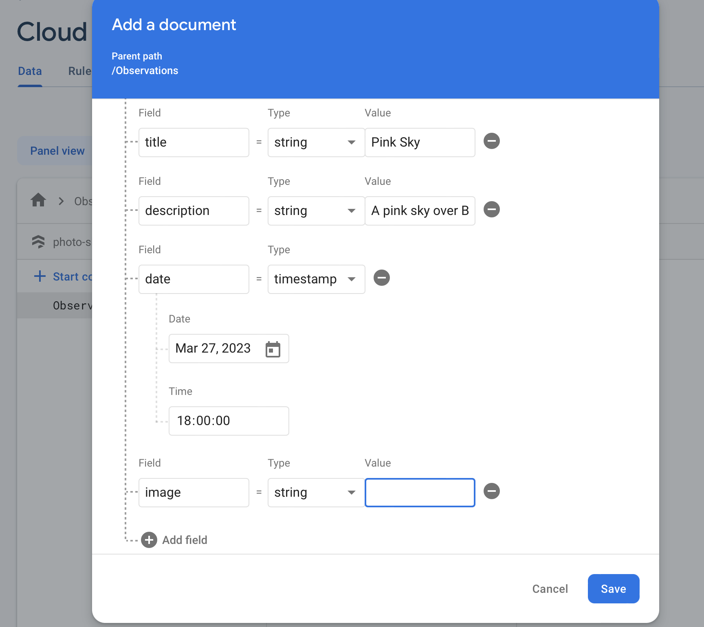

1. Clone the repo, install the dependencies and run the app.
```
git clone https://github.com/madeleinedarbyshire/CMP3035
cd CMP3035/wk9/firestore
npm install
npx expo start --tunnel
```

2. Set up firebase following [this guide](/guides/firebase)

3. Create a collection called Observations. You will need to add at least one document to the collection to complete the setup of the collection so I suggest you use my template observation with the following fields:
    - title: Pink Sky
    - description: A pink sky over Brayford Campus
    - date: [choose any date]
    - image: [I have provided a base64 text encoded image you can use to populate this field at CMP3035/wk9/pink_sky.txt. Select all contents (using CTRL-A) and copy and paste it into the image field]

    

4. From the Firebase dashboard, go to the cog next to Project Overview and get your `firebaseConfig` out of this and paste this into components/Firebase.js.

5. The homepage of the app is the feed - but it's currently empty! To populate it with the content of your Observations collection, implement `subscribeToPosts` in components/Firebase.js. When this is called, use [onSnapshot](https://firebase.google.com/docs/firestore/query-data/listen) to subscribe to changes to a [query on the Observations collection](https://firebase.google.com/docs/firestore/query-data/get-data#get_multiple_documents_from_a_collection). Use [orderBy](https://firebase.google.com/docs/firestore/query-data/order-limit-data#order_and_limit_data) to sort the data by the specified field and in the specified sort direction. The `subscribeToPosts` should return an unsubscribe function.

6. Implement `addPost` in components/Firebase.js so that you can save content you add to the feed. Use the [addDoc](https://firebase.google.com/docs/firestore/manage-data/add-data) function to add a new document with a title, description, image and date to the Observations collection. Use the `fromDate` function from the [Timestamp class](https://firebase.google.com/docs/reference/js/firestore_.timestamp.md#timestamp_class) to convert a [JavaScript Date](https://developer.mozilla.org/en-US/docs/Web/JavaScript/Reference/Global_Objects/Date/Date) object into the right format for Firestore.

7. Implement `updatePost` so that the user can edit the title, description or image in a post. The date should remain unchanged. This can be implemented with either [setDoc](https://firebase.google.com/docs/firestore/manage-data/add-data#set_a_document) (be careful not to overwrite everything with this one!) or [updateDoc](https://firebase.google.com/docs/firestore/manage-data/add-data#update-data).

8. Implement `deletePost` so that the user can delete their posts. Use the [deleteDoc](https://firebase.google.com/docs/firestore/manage-data/delete-data#delete_documents) to delete a document.

9. Implement `likePost` so that the `likes` field on the post increment using the [updateDoc and increment](https://firebase.google.com/docs/firestore/manage-data/add-data#increment_a_numeric_value) function. The likes field does not need to exist beforehand for this to work.

10. Implement `dislikePost` so that the `dislikes` field on the post increment.

11. Add the option in screens/Feed.js to sort the posts by Most Popular (the posts with the highest number of likes to lowest number of likes) by adding to sortOptions array in screens/Feed.js. Note: posts that have 0 likes will not appear since the field hasn't been added because [orderBy filters out items where the field doesn't exist](https://firebase.google.com/docs/firestore/query-data/order-limit-data#orderby_and_existence). You will need to add the `likes` field when posts are created as well as to existing posts (via the Firebase console) to ensure all existing and future posts are returnedrr.