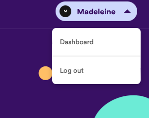

## Setup Spotify Credentials
1. To use the web API you will need a spotify account. If you do not have one, you can sign up for a free account at [spotify.com](https://open.spotify.com).

2. When you have an account go to the [Spotify Developer website](https://developer.spotify.com) and log in if necessary. Navigate to the dashboard. Accept terms of service to complete your account setup.

    

3. In the dashboard, click Create app.

    

4. Add details of your app. You don't need to provide a website but you will need to provide a redirect URI. Put http://localhost:8080 for now.

    

## Create App
1. Create a new app:
```
npx create-expo-app
```

2. Name your app something like album-art or similar when prompted.

3. Install expo and ngrok:
```
cd <your-app>
npm install @expo/ngrok@^4.1.0
npx expo install @expo/vector-icons
```

4. Run your app, scan the QR code and open in your phone:
```
npx expo start --tunnel
```

5. Delete the contents of App.js and replace it with:
    ```jsx
    import { MaterialIcons } from '@expo/vector-icons';
    import { TextInput, View, SafeAreaView, StyleSheet } from 'react-native';
    import { useState } from 'react';

    export default function App() {
      const [token, setToken] = useState('');
      return (
        <SafeAreaView style={styles.container}>
          <View style={styles.subContainer}> 
            <TextInput 
              style={styles.input}
              placeholder={"Artist Name"}
              placeholderTextColor={"#eee"}/>
            <MaterialIcons.Button name="search" style={styles.copy} backgroundColor="#bb1d68" size={22}>
            Search Albums
            </MaterialIcons.Button>
          </View>
        </SafeAreaView>
      );
    }

    const styles = StyleSheet.create({
      container: {
        flex: 1,
        padding: 20,
        backgroundColor: '#010020'
      },
      input: {
        color: '#FFFFFF',
        fontWeight: 'bold',
        fontSize: 20,
        backgroundColor: 'rgba(250, 250, 250, 0.1)',
        padding: 10,
        marginBottom: 10,
        borderRadius: 5
      },
      subContainer: {
        margin: 10
      }
    })
    ```

## Get Token
1. Go to settings in your app's dashboard on the Spotify and retrieve your Client ID and Client Secret.

    

2. At the top of the App function add your credentials:
    ```js
    const client_id = 'your-client-id';
    const client_secret = 'your-client-secret';
    ```

3. To get the token, we are going to use Basic authentication your credentials:
    - Install base-64 libraries:
        ```
        npx expo install base-64
        ```
    - Import encode from base-64:
        ```js
        import { encode } from 'base-64';
        ```
    - Define an async function called getToken() within the App function with a try catch block and a const with your encoded credentials.
      ```js
      const getToken = async () => {
        try {
          const encodedCredentials = encode(client_id + ':' + client_secret)
        }
        catch (err) {
          console.log("Error fetching data-----------", err);
        } 
      };
      ```

4. At the top of the App function, add some state to store the token (remember you will need to import [useState](https://legacy.reactjs.org/docs/hooks-state.html)):
    ```js
    const [token, setToken] = useState('');
    ```

5. Using the [fetch(url, options)](https://developer.mozilla.org/en-US/docs/Web/API/fetch) function (no need to import it) to create a POST method to request a token from the url `https://accounts.spotify.com/api/token` inside the try block in getToken. As stated in the [documentation](https://developer.spotify.com/documentation/web-api/tutorials/client-credentials-flow) (Beware: the JavaScript example in the docs uses a different libraries so don't pay too close attention to this). You will need to provide two headers parameters:
    - `Authorization: Basic <your base64 encoded credentials>`
    - `Content-Type: application/x-www-form-urlencoded`
  The body should be `'grant-type=client-credentials'`.
  ```js
  const response = await fetch(
    "https://accounts.spotify.com/api/token", 
    {
      method: "POST",
      headers: {Authorization: `Basic ${encodedCredentials}`,
                "Content-Type": "application/x-www-form-urlencoded",
                Accept: "application/json"},
      body: "grant_type=client_credentials"
    } 
  );
  ```

6. Get the json body from the response you recieve back.
    ```js
    const body = await response.json();
    const accessToken = body.access_token;
    ```

7. Set `accessToken` as the token in the component state.

8. Test that you can recieving an access token by logging `accessToken` in `getToken`.

9. Call useEffect inside the App function with a function that calls getToken. Remember to import [useEffect](https://legacy.reactjs.org/docs/hooks-effect.html).
  ```jsx
  useEffect(() => {
    if (token === '') {
      getToken();
    }
  });
  ```

## Implement Album Search
1. Create some component state called artist to store the name of the artist.
```js
const [artist, setArtist] = useState('');
```

2. Add a `onChangeText` property to [TextInput](https://reactnative.dev/docs/textinput) so that the artist in the state is set to the value of the TextInput when it is changed.

3. Add some state to store the albums:
    ```js
    const [albums, setAlbums] = useState([]);
    ```

4. Create a new async function called `searchAlbums` inside the `App` function. This will get an artist's albums and will be called when the search button is pressed. If artist is a non-empty string, this should try to call to spotify's [search endpoint](https://developer.spotify.com/documentation/web-api/reference/search) with url `https://api.spotify.com/v1/search`. The url should include the following parameters:
    - `q` (the query string) set to the artist's name
    - `type` should be album
    
    Headers should be:
    - `Accept: application/json`
    - `Authorization: Bearer <your-access-token>`

    As in getToken, should include a catch block that logs an error is this fails.


5. Get the json body out of the response object. Get album items out of the body: `body.albums.items` and set this to be albums in the state.

6. Add the onPress property to the MaterialIcons.Buttons:
```jsx
onPress={searchAlbums}
```

7. Create a function for displaying an album. You will need import `TouchableHighlight`and `Image` from react-native:
    ```jsx
    const item = ({item}) =>  (
      <View style={{flex: 1, flexDirection: 'column', margin: 1}}>
        <TouchableHighlight>
          <View>
            <Image style={styles.imageThumbnail} source={{uri: item.images[1].url}}/>
          </View>
        </TouchableHighlight>
      </View>
    );
    ```

8. Add some styling:
  - Import [Dimensions](https://reactnative.dev/docs/dimensions) from react-native.

  - Get the height and width of the device's screen:
    ```js
    const { height, width } = Dimensions.get('window');
    ```
  - Define imageThumbnail in styles:
    ```js
    imageThumbnail: {
      justifyContent: 'center',
      alignItems: 'center',
      height: width / 2
    }
    ```


8. In the App return function, underneath `View` (subContainer), add the following JSX inside `SafeAreaView`. Remember to import Text and FlatList from react-native. You will see your albums displayed.
  ```jsx
      <View style={styles.mainContainer}>
      {
          albums.length == 0 &&
          <Text style={{padding: 10, color: 'white', marginTop: 30, fontSize: 22}}>
            Type artist name to retrieve album list.
          </Text>
      }
      <FlatList 
          data={albums}
          renderItem={item}
          keyExtractor={item.id}
          numColumns={2}
      />
      </View>
  ```

9. Add some styling for the container:
  ```js
  mainContainer: {
    justifyContent: 'center',
    flex: 1,
    paddingTop: 0
  }
  ```

9. Test by searching for an Artist and seeing their albums.

## Set Up Audio
When the user presses an album image, a preview of that album should play. First, we need to set up audio.
1. Install expo-av:
```
npx expo install expo-av
```

2. Import `Audio`
```js
import { Audio } from 'expo-av';
```

3. Define a function to configure playback:
```js
const setAudio = () => {
    Audio.setAudioModeAsync({
        allowsRecordingIOS: false,
        interruptionModeIOS: 1,
        playsInSilentModeIOS: true,
        shouldDuckAndroid: true,
        interruptionModeAndroid: 1,
        playThroughEarpieceAndroid:false
    })
}
``` 

4. Call the function inside useEffect:
    ```js
    useEffect(() => {
      if (token === '') {
        getToken();
      }
      setAudio();
    });
    ```

## Fetch Tracks
1. Set the onPress property to call a function called `fetchTracks` with the `item.id` when the album image is pressed.

2. Define the function `fetchTracks` that takes an album id as a parameter. Use fetch to get the album from the [album endpoint](https://developer.spotify.com/documentation/web-api/reference/get-an-album) (`https://api.spotify.com/v1/albums/{id}`). Set the market parameter to GB. This is a GET method and the headers are:
    - `Accept: application/json`
    - `Authorization: Bearer <your-access-token>`

3. Get the body from the response. Remember to import Alert from react-native.
```js
const albums = await response.json();
let previewAvailable = false;
for (let i of albums.tracks.items) {
    if (i.preview_url !== null) {
        previewAvailable = true;
        playSound(true, i.preview_url);
        break;
    }
}
if (!previewAvailable) {
    Alert.alert('No preview available for this album');
}
```

4. Define the playSound function as follows:
```js
const playSound = async (playing, track) => {
    const { sound } = await Audio.Sound.createAsync({ uri: track })
    await sound.playAsync();
}
```

5. Test by searching for an artist and pressing to preview their album. Unfortunately, there are quite a few albums that don't have previews. If you're struggling to find an album with a preview, try searching Radiohead and selecting Ok Computer.


